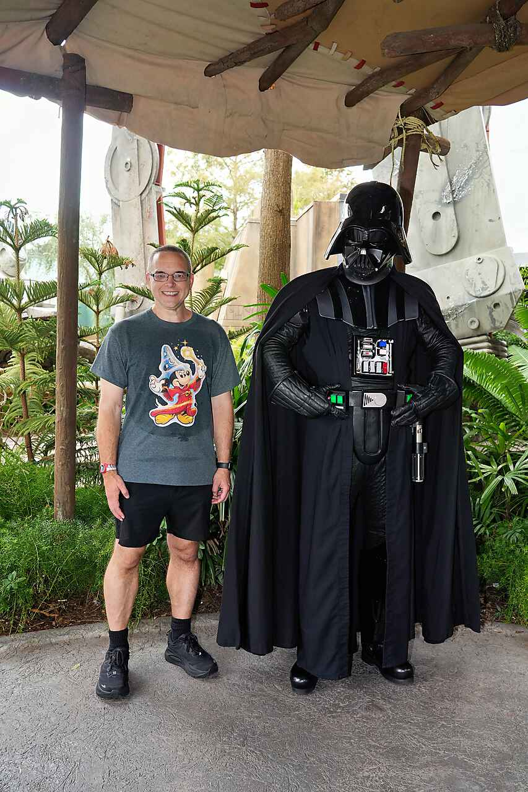

I'm Lewis Cawthorne, a Senior Software Developer at EXL. All posts here are
my own opinions and are in no way reflective of my employer. Day to day I
work on the Subrosource platform: an OSGi backend, an Angular frontend,
Microsoft SQL Server, AWS, HashiCorp tooling (Vault, Consul, Nomad), and
increasingly, AI-assisted development with tools like GitHub Copilot,
Cursor, and Claude Code.

This site is built with [Hugo](https://gohugo.io/) using the
[PaperMod](https://github.com/adityatelange/hugo-PaperMod) theme, hosted on
[GitHub Pages](https://pages.github.com/). Like every personal site ever
built, it is, and will probably always be, a work in progress.

The posts here are a mix of old and new. Some are notes from years ago that
I moved over when I rebuilt the site, kept as-is for the record.
