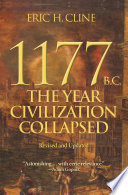

1177 BC is far less a final verdict than I would've preferred. Apparently, historians have discussed the Bronze Age collapse for at least 100 years, but this book mostly calls into question the traditional simple ideas and makes a case for a combination of earthquakes, revolts, and, to a much lesser extent than originally thought, the sea people invading, plus maybe some type of disruption of the trade networks, which again could be caused by the sea people or other unknown maritime raiders.

It's also possible that the private merchant class became more important than the traditional palace-based economy, but many disagree with this opinion despite the fact it has some supporters with good arguments. The sea people may have been more merchant than invader. But this could've happened in the chaos caused by the collapse versus it being a cause of the collapse on its own.

The most important take home is that there are only maybe two clear references to the sea people, the strongest being by Egypt. Others are merely references to enemy ships. So much of the argument for the sea people being the sole cause of collapse is greatly overstated. Especially since many of the cities that fell don't look like sites of combat. People have written entire books on sea people despite the lack of clear evidence. If they existed and contributed, it is more of a small scale falling of a couple of major civilizations such as maybe Egypt, but not a clear contributor to the collapse. Indeed, their artifacts may occur in many places due to them moving in after civilization collapse for other reasons. The only clear remains we have of the sea people are quite questionable. There were definitely cultural changes in artifacts post-collapse.

I learned a lot about how modern history has incorporated scientific methods, including DNA analysis, and it looks like migrant southern Europeans mated with Canaanites rather than invading the area. It's questionable what displaced the southern Europeans, but waves of earthquakes are possible judging by the remains of cities in the area.

There are also at least ten diseases that could've ravaged the late Bronze Age civilizations, but it's difficult to find objective evidence and no one wrote about it if there was widespread disease. Considering there's no clear argument for a single cause, epidemic as a contributing cause isn't out of the question despite the lack of evidence. But that basically translates to the evidence being so poor that guessing is allowed.

There's more evidence than before of widespread drought due to climate change. Some letters point to famines of several of the major kingdoms, and looping back to the "sea people," they could be Europeans driven south and west from famine. Apparently, historians are happy to spend their whole life arguing over drought indicated only by two textual references. Fortunately, new scientific methods have confirmed drought conclusively enough that it is now considered a major historical event. All that information became available since the first edition of this book, and the author was quite hyped about it. It's awfully suspicious that climate change, which is our modern danger, also happened to be at least part of the cause of the Bronze Age collapse, but stranger coincidences have happened even if it could easily be modern historians grasping at modern problems. However, scientific pollen studies, oxygen isotope studies, stalactite growth studies, and studies of the Nile all point to extended droughts in many major kingdoms around 1250-1000 BC.

Honestly, it sounds like this whole book could be replaced by a sentence saying 300 years of drought did it. That's a bit of an oversimplification; he sticks to his guns on the idea that it was multiple factors. But the book author has updated his own opinion to be that drought could easily be the main driver, in opposition to his own opinion in the first edition that drought was not well supported enough to be anything but a minor contributing factor. But there's an open question if it was climate change or volcanic activity that caused the drought. Also, the evidence of revolts in some towns could've been explained by drought and famine, and it likely also contributed to European migration. So everything we talked about is still relevant. The author stands by his point that any one cause would've been lucky to bring down one major civilization, much less all of them, so it is likely drought was a major contributing factor among many others, some possibly connected to the drought. The fact that the drought likely lasted 300 years is why it had a bigger impact than other smaller droughts, and the connected economy likely helped chain the failures when systems started collapsing.

I did learn how much faith historians put in pottery and that the siege of Troy has more historical evidence than the Hebrew Exodus.
