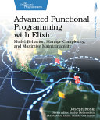

*Advanced Functional Programming with Elixir* turned out to be a pretty good,
easy introduction to functional programming concepts, and it uses good domain
examples instead of math. It walks through Elixir's protocol system with a DDD
slant, using a theme park domain with rides, patrons, and Fast Passes instead of
the numbers-only examples you get in most Haskell books. The code is built
around a companion library called `FunPark`, a teaching-scale version of Koski's
real production package, `Funx`. The theme park was a good choice, and it paid
off most in the `Eq`/`FastPass` chapter, where a real business rule (two Fast
Passes with the same datetime conflict, but should still be equal by `id`)
motivated `contramap` far better than an abstract definition ever could have.

The quality was uneven, but in a predictable way. Eq, Ord, and Predicates were a
low bar that the book cleared easily. Monoid was the standout chapter, and the
one place where all the abstract machinery (`Eq.All`, comparators built with
`contramap`) paid off concretely enough to justify the ceremony. The monad
theory was thin and abstract on its own and only came together once Maybe and
Either gave it somewhere to land. The one real gap was motivation for Reader and
Effect, which never quite sold me. The mechanics were fine, but no example was
compelling enough to answer "why bother wrapping this?"

The Eq and Ord chapters are straightforward once you accept that Elixir
protocols dispatch on struct type only, which forces workarounds like
`contramap` and `to_eq_map` (comparators as plain maps, not just protocol
implementations) the moment your domain needs more than one valid notion of
equality for a type. That ties into DDD nicely, since equality isn't structural,
it depends on the bounded context, so the same type can have different valid
comparators depending on which part of the domain is asking.

The Predicates and Foldable chapter introduced `Foldable` for `Function` (a
predicate as a fold, with zero-arity thunk dispatch) with almost no explanation,
and I had to do some real reconstruction before it landed. It turned out to be a
catamorphism (one function per fixed shape) hiding under a name that sounds like
list reduction. I also caught a bug in the protocol declaration there.
`defprotocol` declared `fold_l(structure, transform_fn, base)`, but every real
implementation and call site used `(structure, acc, func)`, so the protocol's
own docs had the argument names reversed. It's harmless, since protocol callback
names aren't enforced, but it's misleading on a cold read.

Monoid was the best chapter. `Sum` is the toy case, and `Eq.All` and `Eq.Any`
are the real payoff, equality combinators as monoids, with `&&` and `||` doing
the combining. I caught one real typo there too (`default_not_eq` vs.
`default_not_eq?`), and it confirmed a design tension worth remembering: this
machinery is worth it once you have multiple domain-meaningful comparators that
need combining and reusing, but not for a one-off comparison you could write
with `&&` directly.

The monad theory chapter is careful to say it's "inspired by category theory,
not a direct implementation." The laws (left identity, right identity, and
associativity) landed fine once I reverse-engineered `pure`, which shows up
without explanation, as the same idea as `Monoid`'s `wrap`/`empty`, just
Monad-flavored. There's no dedicated Functor chapter, and `map` gets treated as
a free consequence of `bind` and `pure` instead of getting its own build-up,
unlike *From Objects to Functions*, which used Functor as the on-ramp to Monad.

Reader was clean mechanically (the environment as a deferred function,
`ask`/`asks`, and `run` as the escape hatch), but the worked examples were too
small to justify the ceremony over just passing an argument. The one clear win
was swapping `run(computation, prod_env)` for `run(computation, test_env)`,
which is a real dependency injection payoff, independent of the toy examples
around it.

Maybe and Either are where the book actually sold itself. You chain `bind`-based
computations and only check for failure once at the end, instead of doing
constant nil checks, which is a direct answer to how much Go's manual `err !=
nil` checking grates on me. `Either` wins over `Maybe` when you need to carry
_why_ something failed. Choosing `bind` to fail fast versus `ap` to collect all
the errors was the most concrete moment in the whole book where an abstraction
proved its worth, since the same operations give you two different validation
strategies with one shared vocabulary.

Effect never made a compelling case for why actions specifically need to be
trapped in a monad, though the ride repository example was believable as a real
pattern. It was the weakest chapter at justifying its own existence.

I'm not convinced the full ceremony is worth it over Kotlin's null safety for
the `Maybe` case, since that comparison feels close to a wash. Either doesn't
have an equally clean stand-in in Kotlin, though. Kotlin's `Result<T>` is tied
to `Throwable`, so a hand-rolled `Outcome` type or Arrow's `Either` are the real
equivalents, and that's the one idea from this book most likely to actually
change how I write Kotlin.

Overall, it's a good, easy introduction to FP for someone with some prior
exposure who wants examples grounded in a domain instead of math. I'm glad I had
AI on hand to work through the parts the book left underexplained, especially
the Foldable predicate case, since it would've been a rougher read alone.

Full [book notes](https://github.com/llcawthorne/book-notes/blob/main/elixir/advanced-fp/book-notes.md).
