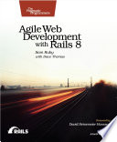

I read this as evening light reading alongside a much more deliberate Haskell
push, and built the whole Depot/Storefront tutorial along the way, with auth,
i18n, Action Mailer/Mailbox, and hundreds of fast passing tests. Coming from a
mostly JEE/JSF background (with a little Angular thrown in), I expected Rails'
"Cadillac, all-bells-and-whistles" reputation to feel dated by 2026. It didn't.
It's still the batteries-included framework, and the batteries are good ones: a
rich text editor built in, which I had to bolt onto my own JEE app; a full email
system in both directions, Action Mailer for outgoing with genuinely
well-thought-out test-mode delivery support, Action Mailbox for incoming routed
like a controller. I don't expect a web framework to check my email for me, and
I'm not sure I'd trust it over something like Mailchimp once you need real
deliverability at scale, but as a "we already thought of that" touch I was
impressed, and the testing support around it is A+.

On views, I think my team's move to JSF was a step backward, and Rails
reinforced that. ERB is happy to just be light HTML with a little programmatic
output sprinkled in, the same way JSP is fine if you use it with a light touch
and don't let logic creep in, and the book gives the same DRY warning I'd give
myself. Slim was in there as an option and genuinely looked like an upgrade in
conciseness, but I stayed away from it deliberately, once you step away from raw
HTML you sometimes tie your own hands, and direct HTML access is one of the
places JSF shoots itself in the foot. Turbo and Stimulus impressed me more than
expected too. As a longtime JSF developer I'm instinctively wary of anything
promising to hide JavaScript from you, but Turbo/Stimulus make JS a first-class
citizen without demanding you write obnoxious amounts of it.

Testing was the sharpest contrast with JEE. Heavyweight containers make fast
test cycles a real problem, and Capybara spinning up a lightweight server
against headless Chrome, backed by Minitest that's actually fast, means I've got
hundreds of tests now and still don't think twice about running the whole suite,
or just a relevant subset. System tests were occasionally flaky without retries
though, which brought back some uncomfortable memories of flaky Selenium and Geb
tests from my Java days. I'm a BDD fan, so RSpec being a real drop-in swap for
Minitest mattered to me, same reason I liked Geb (Groovy) back when I was
Groovy-curious and why I already love hspec in Haskell.

ActiveRecord's reflection-based models were a big step up coming from Java: no
verbose POJO to wire up for every new table, no middleware class you're forced
to add just to have somewhere to put nothing. It even writes most of the
migration for you. I assume most modern frameworks have caught up on this front
by now, but coming from the old-fashioned way, it's slick. I also appreciated
that Rails doesn't force a heavy middleware layer on you; MVC is enough
separation for most of what I do, and in my JEE app that middle tier tends to be
a repetitive passthrough. Rails is comfortable letting the controller hold
logic, or pushing it down to the model as the last line of enforcement, which is
the better default.

i18n was convenient too: wrapping things in `t()` calls is a bit of a chore, but
I've done worse to a frontend, and having everything, including ActiveRecord's
own validation error messages, live in the same YAML files beats splitting your
translations from the framework's built-in ones the way Java properties files
tend to.

Most of my reactions here are colored by the JEE lens, and most things look good
next to JEE, it's an old, overcomplicated, designed-by-committee way of building
web apps. But Rails earned its reputation independent of that comparison: an
all-inclusive framework that stays flexible everywhere except right at its core
(try ripping out Active Record and ask whether you're still using Rails).
Django's next on the list, then a pure JavaScript frontend, then something
slimmed down like a Go microservice or a Compojure backend, to see what the
batteries-included approach actually costs you once the batteries are gone.

Full [book notes](https://github.com/llcawthorne/book-notes/blob/main/ruby/agile-web-development/book-notes.md).
