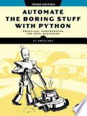

Sometimes it's fun to read easy books, and this was an easy, fun book. It didn't
go into as much depth about Python as the Python Tutorial on the Python website,
but it covered the basics, then went on a romping overview of using all sorts of
libraries to perform tasks you might need to perform. Some of the tasks were
pretty relevant, like loading an Excel file, working with JSON, or sending
yourself an email; others were cool and could be put to creative uses, like
driving a web browser with Playwright or working with a SQLite database; and
some were kind of niche topics that I'd look back up if I ever needed to deal
with them, like working with XML, OCR, or speech recognition. They were all kind
of fun to play with, so I enjoyed reading this book.

Full [book notes](https://github.com/llcawthorne/book-notes/blob/main/python/automate-the-boring-stuff/book-notes.md).
