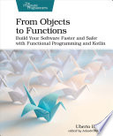

This was one of the better books I've read recently for actually changing how I think about programming. It combines domain-driven design, test-first development, and functional programming into one coherent story, which is pretty rare, since most books only tackle one of those at a time. Unlike some of my other recent reads, the Kotlin itself was well-structured and idiomatic throughout, not just functional-flavored Java.

The book builds a real app, a to-do list called Zettai, outside-in with TDD, starting from acceptance tests and working down to the domain core. It uses http4k, which the author picked specifically for its "everything is a function" philosophy (an `HttpHandler` is just `(Request) -> Response`), and Exposed for persistence. The book's repo only has the start and end states for each step (step1 through step7, spread loosely across 13 chapters) rather than the intermediate changes, so I had to lean on the book's prose to follow _why_ the code evolved the way it did and not just _what_ it ended up as.

The book starts with actor-based domain-driven testing and works its way through receiver-typed lambdas and extension functions, higher-order functions and purity, and a hub-and-spokes (ports and adapters) architecture before it gets into the theory. From there it covers monoids (with a door state machine example), functors, monads, and applicatives, then event sourcing and profunctors, and it finishes with a logging and JSON capstone that pulls everything together. The theory was mostly motivated with real code before the abstraction got a name, which I appreciated. Functors come out of `Holder`, `List`, and `Outcome`, and then `ProjectionQuery` deliberately breaks the container idea to push you into thinking of them as computations instead of containers. Monads come from a concrete `TxReader<TxReader<T>>` nesting problem instead of being introduced abstractly, and applicatives show up through error-accumulating validation with `` `!` `` and `` `*` `` operators, contrasted against the way monads short-circuit. The exceptions were the door monoid section and parts of chapter 7, where the vocabulary showed up before the payoff did. That was disorienting in the moment, even though the payoff did eventually arrive by the end of the chapter.

The Kotlin was the kind you'd want to see in a strong codebase, with extension functions, receiver types, sealed classes, and generics all used the way they're meant to be used and not just as vehicles for FP theory. The actor-based test framework, Pesticide, was a neat pattern too, you write a test once and run it against the domain, a local HTTP server, or a deployed instance, even if I'm not sure I'd adopt the library itself over something mainstream like kotest.

The final third, especially the logging and JSON chapters, had a noticeably higher error rate than the rest of the book. Functions like `storeEvents` got used before they were shown, parameter counts didn't match, and field names had typos. The JSON chapter has you build a hand-rolled JSON library that even the author admits he was "wary" of introducing, and it's incomplete, since its own reflection-based code generation "seldom works right without manual intervention." A thin adapter wrapping kotlinx.serialization in an `Outcome` probably would have served the book's own goals better than building JSON parsing from scratch. There's also an optional 50-page category theory appendix, which was a mixed bag. Functors, monads, and comonads mostly confirmed what the main text had already taught me, and Kleisli categories turned out to be `bind` with different notation once I decoded them, but profunctors and the Yoneda lemma were presented abstractly enough that I had to reconstruct them from the code examples myself before they landed.

Looking back at it now, after a stretch in Haskell, I remember a lot more about the DDD and TDD from this book than I do about the details of Kotlin. It was really into TDD, with the whole app built outside-in from acceptance tests, and I miss that now that I'm working through 1000 pages of *Django 5 By Example* without a single test in them. Anyway, it's a dense book, but it was worth the length, and it changed how I think about combining DDD, testing, and FP instead of treating them as separate concerns. I'd recommend it to someone with some Kotlin under their belt and the patience for some rough editing toward the end.

Full [book notes](https://github.com/llcawthorne/book-notes/blob/main/kotlin/from-objects-to-functions/book-notes.md).
