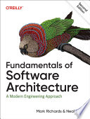

The best part of the book was section 2, where it described different
architecture styles and gave each one star ratings across a variety of
characteristics, which I'm sure come from the authors' experience with each
style. I also liked how it framed microservices as part of a trend pendulum,
reacting against the reuse pain that SOA left behind, since I like noticing when
a new trend is really just correcting for the last one's mistakes. I'm not an
architect currently, so I have no need for architecture decision records (ADRs),
except maybe for technical decisions made on personal projects so I can go back
and remember the thought that went into them. I may start using
[adr-tools](https://github.com/npryce/adr-tools) on my own for that. Since I
mostly listened to this on runs, my notes don't really do it justice. I want to
go back sometime when I'm not out of breath and write proper summaries of the
ratings for each architecture style.

Full [book notes](https://github.com/llcawthorne/book-notes/blob/main/architecture/fundamentals-of-software-architecture/book-notes.md).
