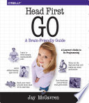

Overall, it's what I expect from a Head First book. It was a perfectly
serviceable introduction to the Go programming language. Although it's a Head
First book, I feel like it treated me like an experienced programmer and
didn't waste a lot of time explaining how an `if` expression worked. Unlike
*Head First Kotlin* which never got to a lot of things that it had to toss
into *Ten Brief Topics in the Appendix*, it felt like it covered all the main
topics that needed to be covered to understand Go. It even includes coverage
of automated testing and a couple of chapters on web apps.

Full [book notes](https://github.com/llcawthorne/book-notes/blob/main/go/headfirstgo/book-notes.md).
