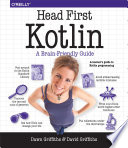

Better than initially assessed: Chapter 2 introduces collections, good variance
coverage (with a Pet hierarchy), covers extensions and their role in the stdlib,
two lambda/HOF chapters. Unusual ordering: generics before lambdas.
map/filter/fold deferred to lambda chapters. Coroutines appendix exists but
dated.

*Head First Kotlin* uses the usual Head First spiral approach - introduce a
concept lightly, let it sit, circle back with depth later - which meant it
deferred anything not strictly load-bearing to the appendices. Labeled breaks
and enum classes, both things I'd consider core language features, got pushed
all the way to Appendix C rather than covered in the main chapters. That
appendix is even honest about it in the title: "The Top Ten Things (We Didn't
Cover)" - ten separate topics, including packages, visibility modifiers, sealed
classes, and object declarations, that never made it into the twelve main
chapters at all.

Compare that to *Head First Go*, which felt reasonably complete without needing to
punt a top-ten list to the back of the book - but that's not really a fair
fight. Go is a deliberately small language by design (that's Rob Pike's whole
philosophy. Minimal surface area, few ways to do anything), so a Head First
treatment of it has a real shot at covering the whole language in the main
chapters. Kotlin's surface area is just bigger: null safety, data classes,
sealed classes, extension functions, coroutines, object
expressions/declarations, operator overloading. So a book aimed at teaching it
from scratch in a similarly-sized page count is going to hit a wall and have to
defer something. It's less "Head First Kotlin did a worse job" and more "the two
books picked structurally different-sized languages to cover with the same
format."

Full [book notes](https://github.com/llcawthorne/book-notes/blob/main/kotlin/head-first-kotlin/book-notes.md).
