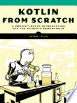

*Kotlin from Scratch* is a project book, and the projects are mostly math and computation: Euclid's algorithm, the Sieve of Eratosthenes, Fibonacci, physics simulations, fractals, sorting, and A* search. It was good typing practice, and some of the math and algorithms were really interesting, but it was disappointing as a source of good Kotlin code. The first two chapters covered the language fundamentals in almost as much depth as all of *Head First Kotlin*, but that depth never came back. Nothing after chapter 2 touches generics, sealed classes, delegation, or coroutines, extension functions never show up, and the language features stay limited. Chapter 3 was a whole detour into JavaFX that I didn't ask for and won't need for Android or Swift, though I don't regret typing it, since the Stage and Scene boilerplate turned into a really cool spiral, and fighting the Gradle multi-module setup taught me more about the build system than the book itself did.

The author's code quality was the real letdown. He leans on mutable `var`s constantly, and worse, on global mutable state. If anything, spotting all those `var`s helped remind me to use more `val`s. The genetic algorithm chapter had `tournament()` calls with no parameters that still returned different results every time, because they were secretly reaching into a global population plus some randomness, so there's no referential transparency and no way to reason about a call site without reading the function body. The comments were often pure noise too, like `// Run the genetic algorithm` sitting right above `runGA()`. Project 16 was missing an entire function, which the errata later confirmed wasn't my mistake, so I pulled that one from the GitHub companion repo instead of fighting a broken example.

The `fold` and `map` chapter was a letdown in a different way. It only reached for the classic textbook examples of summing a list, calculating a product, and concatenating strings, and nothing that shows off what the tools are actually for. I ended up chewing on a much better example on my own, finding all the subsets of a set (the power set). I worked that out mostly by instinct, keeping the subsets so far and, for each new element, adding a copy of every existing subset with that element in it, before I ever realized `fold` was the idiomatic way to express it. Even where the book _does_ introduce a powerful construct, it plays it safe with examples that don't show its range. One thing it did get right, which I wouldn't have assumed coming from Java, is its package-naming advice to "join multiple words or use camelCase," which checks out against the official Kotlin coding conventions, since they explicitly allow both.

I skipped typing the Modeling/Simulation and Fractals chapters, since they were more JavaFX and more of the same mutable-state pattern, and just skimmed them on GitHub instead. The sorting and searching chapter (chapter 7) had the cleanest code in the book, with fewer `var`s, and the ones it had were properly scoped instead of global. In-place sorting algorithms are supposed to mutate anyway, so that's not really a knock.

The genetic algorithm (GA) chapter and the particle swarm optimization (PSO) and ant colony chapter were the highlight. I typed three GA variants by hand (a toy problem, a knapsack problem, and multivariate equation solving, by way of the "weasel program" Shakespeare quote demo), then took the GitHub shortcut for PSO and the traveling salesman ant simulation once I'd internalized the pattern. PSO actually beat the GA on the Eggholder problem, it took fewer generations, found a solution the GA never found in multiple runs, and didn't get stuck in the same local optimum the GA kept falling into.

So it's worth reading for the algorithms and the typing reps, but not for the Kotlin, and I wouldn't recommend it as a "here's good idiomatic Kotlin" reference.

Full [book notes](https://github.com/llcawthorne/book-notes/blob/main/kotlin/kotlin-from-scratch/book-notes.md).
