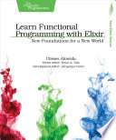

A perfectly good introduction to the Elixir language, although it didn't have
anything specific to learning functional programming in it beyond getting used
to doing things the Elixir way. I guess it had more recursion than most
introductory programming books... It feels like a terrible introduction in
comparison to Dave Thomas' *Programming Elixir* though, since it stops totally
short of introducing the Actor model and OTP, which are unique strengths of
Elixir, but that's obviously a longer book to read.

Full [book notes](https://github.com/llcawthorne/book-notes/blob/main/elixir/learn-fp/book-notes.md).
