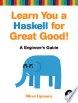

*Learn You a Haskell* (LYAH) is the friendly, illustrated, free online Haskell
introduction that a lot of people start with. I read it as the third track in my
Haskell study, alongside *The Haskell Book* for the deep theory and laws and
*Haskell by Example* for project-driven practice, and I own it in print, mostly
to support the author.

LYAH ended up being my "medium" book. It wasn't demanding enough to need my
protected morning focus time, but it wasn't throwaway reading either. It moves
fast and covers an enormous amount of ground in relatively few pages, and it
rarely gives you exercises, so it was easy to pick up between chapters of my
heavier books, but I also retained less from it than from the books where I was
typing and testing code. More than once I described it as a book where you're
lucky to keep anything, but you'll recognize the topic when it comes up again
somewhere else, and that turned out to be worth a lot, since plenty of concepts
were already familiar by the time *The Haskell Book* covered them properly.

Some of its explanations are really excellent, good enough that I thought about
a second pass just to capture them in notes. Its treatment of IO and functors
pushed back on the "IO is a magic box" idea I'd picked up elsewhere and reframed
IO as just one more thing that supports `fmap`. Folding a tree with `foldMap`
into any monoid was the first time Monoid felt useful to me. Toy examples like
`Sum` and `Product` never sold it, since `+` and `*` are already right there,
but one traversal that can collapse the structure in different ways depending
only on which monoid you pick is the real pitch. The State monad clicked here
too, and it made it clear that State solves a problem you mostly only have in a
pure language. Using `filterM` with a Writer to log was intuitive, and using it
with `[True, False]` to generate a power set was a great "aha" moment for how
the list monad branches. The Monads and Zippers chapters are the standouts, and
if someone only read two chapters of LYAH, I'd point them there.

It does have some weak spots. Without exercises, a lot slides by, so it's more
of a tour than a workout. It uses some functions before explaining them, like
leaning on `sequenceA` and comparing it to `sequence` without ever properly
introducing `sequence`, which is easy enough to fill in but adds friction. And
it just stops, with no wrap-up or sense of where to go next, so it reads like an
online tutorial that got bound into a book, which is basically what it is.

LYAH is a good read and a great companion book, but not a primary one. Its best
explanations (IO, Functor, Monoid via `foldMap`, State, Monads, and Zippers)
make it worth reading on their own, and its breadth gives you a mental map of
the territory, but if you want Haskell to stick, pair it with something that
makes you write code. For me, *The Haskell Book* supplied the depth and the
laws, *Haskell by Example* supplied the projects, and LYAH supplied friendly
first encounters and a few explanations I still think are the best I've seen.
