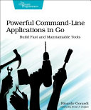

This was a good way to see a number of non-trivial applications in Go. It
tackled real projects like a Markdown Previewer and a Port Scanner and used
production-grade libraries like Cobra for command-line arguments and Viper for
configuration settings. The Markdown Previewer was probably good enough for me
to consider using it. Honestly, Cobra and Viper were good enough libraries
that it makes me start looking at what my options are for command-line
parsing libraries early when studying a new language now. A lot of the
examples were big to type, but that is good since it made me feel more
comfortable with the language. They were also complicated enough that I made
mistakes and got to deal with error messages from the compiler. I will say I
was disappointed multiple times that Go's compiler points out the first error
it finds and then stops, so when you fix it you might just be greeted by
another error. It's not like Java or Kotlin where the compiler spits out 10
errors and 5 are probably caused by the earlier errors but the other 5 need
to be corrected. The pomodoro app was actually quite usable after I got past
the fact that it wouldn't display correctly in tmux. That was a hard
debugging session wondering what was wrong with my output from typing up the
code before I finally pinned the blame on running it in a tmux session
though, since having a tmux session is just getting so normal to me. Not only
did I learn a lot about using Go for small to intermediate-sized projects,
but I learned a lot about writing good command-line apps that I can take
with me to other languages.

Full [book notes](https://github.com/llcawthorne/book-notes/blob/main/go/pragprog.com/rggo/book-notes.md).
