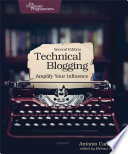

*Technical Blogging* talked a lot more about SEO, blog promotion, how to benefit
from being a blogger, and how to scale; all good problems to have but a little
early to worry about when you don't have a blog yet. There was maybe a chapter
on the actual act of blogging, but it was mostly watered-down *Getting Things
Done* advice and a brief sketch of the pomodoro technique. It did remind me that
I always wanted to check out the Things app for managing to-dos and projects,
and it made me notice that Pragmatic Bookshelf has another entire book on the
Pomodoro Technique (I can't imagine what they have to say about it at book
length, but several authors have managed to talk about the Pomodoro Technique
for an entire book, judging from my Amazon results).

It also made me realize that it's been fifteen years since I read *Getting
Things Done*. I don't have as much stuff to get done as I did back in school
when I was working on a PhD and teaching classes too, but maybe I'll re-read it
anyway. It had useful productivity advice. I didn't learn anything about
productivity from what was in the *Technical Blogging* book. I also don't plan
to blog like it's another job where I find myself spending 3-4 hours a week
writing posts and need to schedule it in; I'm mostly reviewing books - when I
finish a book, I can write a blogpost. I want to blog, but I'd rather spend most
of my productive time reading and coding and when I am feeling creative put my
thoughts out there.

One good idea from this book that was worth the price of admission was
submitting a blog to Planet Haskell and/or Planet Clojure. You can submit just
the proper tag feed to them so you are free to get off topic without getting
into trouble, and they can push your posts out there for the world. It would be
so cool to be featured by one of the Planets, as I've been subscribed to their
RSS feeds for as long as I've had an RSS reader, even if I didn't keep up for a
time.
