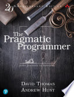

I first read *The Pragmatic Programmer* years ago, and the 20th anniversary
edition holds up really well. It isn't just a nostalgia lap, since the updates
feel necessary, folding in ideas like ETC ("Easier to Change"), functional-style
data pipelines, and more modern concurrency patterns without losing the voice
that made the original a classic. It reads less like a list of rules and more
like advice from people who have actually shipped things and learned from what
went wrong.

I listened to it as an audiobook, and it worked better than I expected for a
book this dense with concepts. The narration keeps a good pace, and the material
is conversational enough that it doesn't need diagrams on every page to land. If
you've read the original, it's worth a revisit, and if you haven't, this is the
version to start with.

Full [book notes](https://github.com/llcawthorne/book-notes/blob/main/architecture/the-pragmatic-programmer/book-notes.md).
