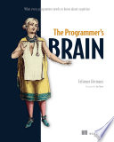

I didn't find a lot of the advice in this book terribly useful. It mostly seemed
like common sense backed by a bit of research. The onboarding advice was
probably the most useful part, if only because I'm senior enough now that it
might come in handy with junior colleagues. The idea is basically to focus on
single activities at first, starting with concrete code instead of diagrams, and
remembering that everything is new to them. It is easy to forget once you've
been steeped in a codebase for years.

The Roles of Variables Framework was new to me too. I actually paused my run to
jot down the key ideas since it felt worth remembering, even though I wasn't
sure how valuable it would be in practice. Looking at my own code though, I
mostly stick to "fixed value" variables over any of the other roles (`val`s in
Kotlin, and I'm trying to do some Haskell on the side for fun). I also liked the
advice on dealing with interruptions by offloading as much of your thought
process as possible instead of trying to hold it all in your head. That's
basically what I use Obsidian for at home, and at work I've had the same
`notes.txt` file open for ten years that's probably 50 pages long by now.

Full [book notes](https://github.com/llcawthorne/book-notes/blob/main/architecture/the-programmers-brain/book-notes.md).
